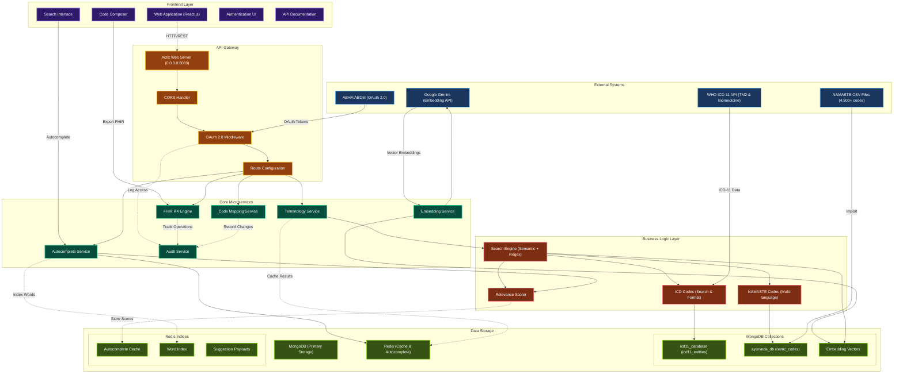

# CodeVedas SIH — FHIR Terminology Microservice
**Team ID: SRM-SIH-322**

A lightweight FHIR R4-compliant terminology microservice that integrates India's NAMASTE terminologies and WHO ICD-11 (Traditional Medicine Module 2 and Biomedicine) into EMR/EHR systems. Enables dual coding, autocomplete search, and secure bundle ingestion aligned with India's 2016 EHR Standards.

## 🎯 Problem Statement
**ID: 25026** - Develop API to integrate NAMASTE and ICD-11 TM2 into existing EMR systems compliant with Electronic Health Record (EHR) Standards for India.

## ✨ Key Features

### 🔍 **Intelligent Search & Autocomplete**
- **Fast autocomplete** with Redis-backed ranking (code + title only)
- **Semantic search** using Gemini embeddings for context-aware results
- **Multi-terminology search** across NAMASTE, ICD-11 TM2, and Biomedicine
- **Language support** for Hindi, English, and Sanskrit terms

### 🏥 **Medical Terminology Integration**
- **NAMASTE codes** - 4,500+ Ayurveda, Siddha, Unani disorders
- **ICD-11 TM2** - Traditional Medicine Module 2 integration
- **ICD-11 Biomedicine** - Standard biomedical classification
- **Dual coding** support for traditional + biomedical diagnoses


## 🏗️ Architecture



## 🚀 Quick Start

### Prerequisites
- **Rust** (stable)
- **MongoDB** and **Redis**
- **Docker** (optional for ICD-API)

### Installation

1. **Install Dependencies**
```bash
# MongoDB on Ubuntu
curl -fsSL https://www.mongodb.org/static/pgp/server-8.0.asc | sudo gpg -o /etc/apt/trusted.gpg.d/mongodb-server-8.0.gpg --dearmor && echo "deb [ arch=amd64,arm64 ] https://repo.mongodb.org/apt/ubuntu jammy/mongodb-org/8.0 multiverse" | sudo tee /etc/apt/sources.list.d/mongodb-org-8.0.list && sudo apt update && sudo apt install mongodb-org -y

# Redis
sudo apt install redis-server -y
```

2. **Setup Environment**
```bash
# Create .env file
cp .envexample .env
```

3. **Import Data navigate to their directory and paste the respective commands**
```bash
# Import NAMASTE codes
mongoimport --db ayurveda_db --collection namc_codes --type csv --headerline --file "NAMC_FINAL.csv"

# Import ICD-11 codes
mongoimport --db icd11_database --collection icd11_entities --type csv --headerline --file icd11_mms.csv

# Create indexes
mongosh icd11_database --eval "
db.icd11_entities.createIndex({'id': 1}, {unique: true});
db.icd11_entities.createIndex({'code': 1}, {sparse: true});
db.icd11_entities.createIndex({'parent': 1});
db.icd11_entities.createIndex({'title': 'text', 'definition': 'text', 'synonyms': 'text'});
print('Indexes created successfully');
"
```

4. **Start Server**
```bash
cargo run
```

5. **Initialize Autocomplete**
```bash
curl -X POST http://localhost:8080/autocomplete/initialize
```

## 🔗 API Endpoints

Comprehensive API documentation is automatically generated and made available when the application is deployed in either backend or frontend environments. This documentation serves as the primary reference for all available endpoints and provides detailed technical specifications for system integration.

### Documentation Access

The API documentation is accessible through designated documentation endpoints that are established during application runtime. This automated documentation generation ensures that all endpoint specifications remain current and accurately reflect the deployed API implementation.

### Testing
```bash
# Test autocomplete
curl "http://localhost:8080/autocomplete/suggestions?query=cholera&limit=3"

# Test semantic search
curl "http://localhost:8080/terminology/search?search=fever&method=semantic&limit=5"

# Test NAMASTE codes
curl "http://localhost:8080/namaste/search?search=Jwara&limit=5&language=both"
```

## 📊 Data Sources

| Source | Count | Description |
|--------|--------|-------------|
| **NAMASTE** | 4,500+ | Ayurveda, Siddha, Unani disorders |
| **ICD-11 TM2** | 529 | Traditional Medicine Module 2 |
| **ICD-11 MMS** | 55,000+ | Biomedical classification |

## 🎯 Use Cases

1. **Clinical Documentation** - Dual coding for traditional + biomedical diagnoses
2. **Insurance Claims** - ICD-11 compliant coding for Ayush insurance
3. **Research Analytics** - Standardized terminology for morbidity studies
4. **EMR Integration** - FHIR-compliant terminology services

*** 

**Team SRM-SIH-322** | Ministry of Ayush — AIIA | Smart India Hackathon 2025

## Reference links
[1](https://icd.who.int/browse/2025-01/mms/en)
[2](https://namaste.ayush.gov.in/ayurveda)
[3](https://build.fhir.org/codesystem.html)
[4](https://icd.who.int/docs/icd-api/APIDoc-Version2/)
